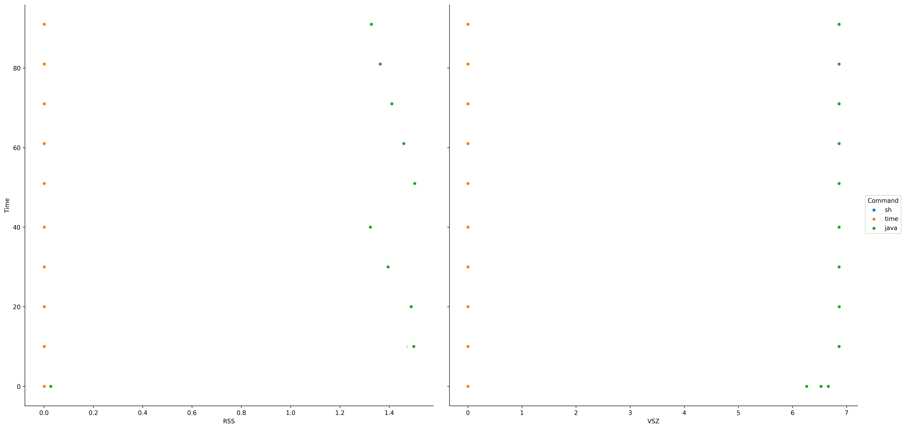
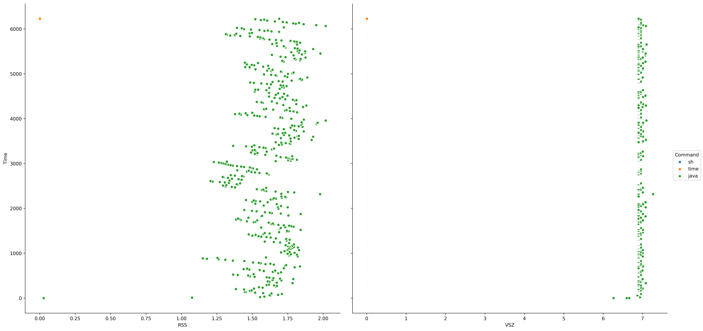

# ppmonitor

### 主要目的

内存监控

### 依赖的包及软件

python3.5
```
cycler (0.10.0)
matplotlib (2.1.1)
numpy (1.14.0)
pandas (0.21.1)
pip (9.0.1)
pyparsing (2.2.0)
python-dateutil (2.6.1)
pytz (2017.3)
scipy (1.0.0)
seaborn (0.8.1)
setuptools (38.4.0)
six (1.11.0)
wheel (0.30.0)
```

`sysstat 版本 11.2.0 pidstat`


### 使用说明


```
usage: ppmonitor [-h] -sh SHELLSCRIPT -o OUT [-t TMP] [-log LOG]

shell脚本监控程序，监控shell脚本中每一行命令所用内存及cpu统计

optional arguments:
  -h, --help            show this help message and exit
  -sh SHELLSCRIPT, --shell SHELLSCRIPT
                        shell脚本，e.g. test.sh
  -o OUT, --out OUT     输出目录prefix
  -t TMP, --tmp TMP     tmp目录，e.g. /tmp/
  -log LOG, --log LOG   log，e.g. test.sh.log
```

*例如*
```
ppmonitor \
    -sh ~/PROJECTS/variant_call_somatic_20180104/src/mutect2.sh \
    -o ~/PROJECTS/variant_call_somatic_20180104/src/mutect2.stat \
    -t ~/TMPS/
```

### 结果说明

**输出两个文件**

>目前该程序处于测试阶段，如果有任何建议或意见随时沟通提醒


1. Time_VSZ_RSS.png(内存与时间关系图)


2. summary.csv(各项数据统计结果)


**为了便于输出，下面说明中的`%`在结果中可能会被`p`替代，例如`%CPU`可能在结果中为`pCPU`**

**统计中的时间均为秒，如图中所示的时间单位也均为秒。整个内存的统计是每`10`秒统计一次**

- **PID** - 被监控的任务的进程号
- **%usr** - 当在用户层执行(应用程序)时这个任务的cpu使用率，和 nice 优先级无关。注意这个字段计算的cpu时间不包括在虚拟处理器中花去的时间。
- **%system** - 这个任务在系统层使用时的cpu使用率。
- **%guest** - 任务花费在虚拟机上的cpu使用率（运行在虚拟处理器）。
- **%CPU** - 任务总的cpu使用率。在SMP环境(多处理器)中，如果在命令行中输入-I参数的话，cpu使用率会除以你的cpu数量。
- **CPU** - 正在运行这个任务的处理器编号。
- **Command** - 这个任务的命令名称。
- **kB_rd/s** - 任务从硬盘上的读取速度（kb）
- **kB_wr/s** - 任务向硬盘中的写入速度（kb）
- **kB_ccwr/s** - 任务写入磁盘被取消的速率（kb）
- **minflt/s** - 从内存中加载数据时每秒出现的小的错误的数目，这些不要求从磁盘载入内存页面。
- **majflt/s** - 从内存中加载数据时每秒出现的较大错误的数目，这些要求从磁盘载入内存页面。
- **VSZ** - 虚拟容量：整个进程的虚拟内存使用（Gb）
- **RSS** - 长期内存使用：任务的不可交换物理内存的使用量（Gb）


### 实例

测试脚本：`mutect2.sh`
```
/usr/bin/java \
    -Djava.io.tmpdir=/TMPS/  \
    -Xmx4g \
    -jar GenomeAnalysisTK.jar \
    -T MuTect2 \
    -R hg19.fasta \
    -L target.intervals \
    -dt NONE \
    -I:tumor TEST1.bam  \
    -o Test1.mutect2.vcf.gz
```

运行：
```
ppmonitor \
    -sh mutect2.sh \
    -o ~/TMPS/mutect2.stat \
    -t ~/TMPS/
```

**经过运行获得了以下文件：**

1. mutect2.stat.Time_VSZ_RSS.png



2. [mutect2.stat.summary.csv](./testdata/mutect2.stat.summary.csv)